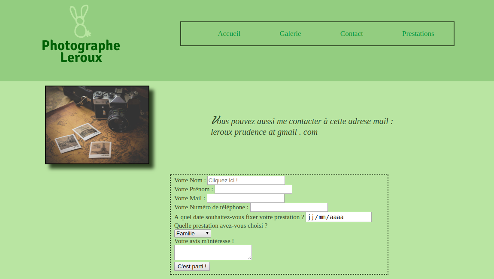

# Site Photographe 

### Technologies : 
* Sass
* Html 
* Css 
* Architecture 7-1

### Objectifs : 
* Répondre aux exigences du client,
* Connaître et apprendre la technologie Sass
* Apprendre à créer une bonne architecture (Architecture 7-1)
* Apprendre à créer des wireframes adaptés pour ordinateur et téléphone
